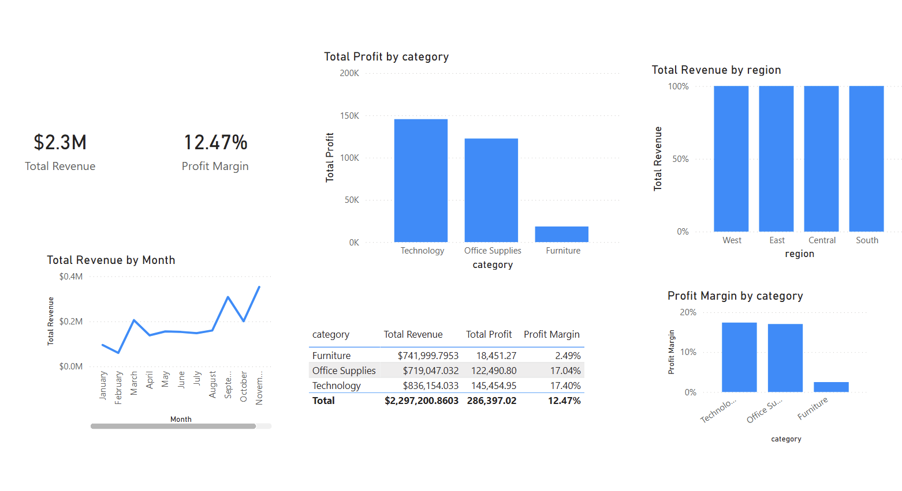
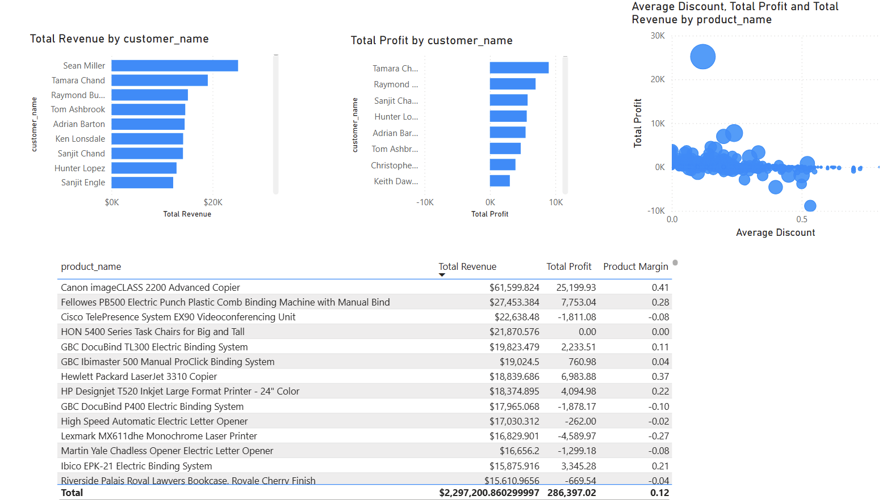

# Retail Profit Optimization & Margin Risk Analysis

## Objective

This project simulates a real-world retail scenario where sales data is analyzed to support strategic decision-making, identify structural profitability risks, and optimize financial performance.

The primary objective is to demonstrate how data analysis can move beyond revenue tracking and focus on sustainable margin optimization.

---

## Business Context

The dataset represents a multi-category retail company operating across multiple U.S. regions.

Although the company generates over $2.3M in revenue, the central question is:

**Is this growth financially sustainable?**

The strategic focus of this analysis is profitability diagnostics and margin risk detection.

---

## Project Scope

The analysis follows a structured workflow aligned with professional data analysis practices:

- Data cleaning and preparation (Python)
- Exploratory Data Analysis (EDA)
- KPI calculation
- Profitability diagnostics
- Customer concentration analysis (Pareto)
- Margin risk detection
- Executive dashboard creation (Power BI)

---

## Core Business Questions

- Is revenue growth aligned with profitability?
- Which categories drive margin erosion?
- Are discounts impacting financial sustainability?
- Is revenue concentrated among a small customer base?
- What structural financial risks exist?
- Can revenue be forecasted using historical trends?

---

## Key Performance Indicators (KPIs)

- Total Revenue
- Total Profit
- Profit Margin
- Revenue by Region
- Profit Margin by Category
- Customer Revenue Contribution
- Monthly Revenue Trend
- Margin Risk Indicators

---

## Tools & Technologies

- Python (Pandas, NumPy)
- Data Visualization (Matplotlib, Seaborn)
- Scikit-learn (baseline forecasting)
- Jupyter Notebook
- Power BI (Executive Dashboard)
- Git & GitHub

---

## Project Structure

business-data-analysis
│
├── README.md
├── business_brief.md
├── notebooks/
│   └── business_analysis.ipynb
│
├── data/
│   ├── raw/
│   │   └── sales.csv
│   └── processed/
│       └── processed_sales.csv
│
├── powerbi/
│   ├── sales_dashboard.pbix
│   └── images/
│       └── dashboard/
│           ├── executive_overview.png
│           ├── customers_and_product_insights.png
│           └── customer_concentration_analysis.png
│
├── images/
│   └── python/
│
└── .gitignore
---

---

# Power BI Dashboard

## Executive Overview

This page provides a high-level financial summary including revenue, profit, margin, trend analysis, and regional performance.

---

## Customer & Product Insights

Highlights structural profitability differences across product categories and identifies financial imbalance drivers.

---

## Customer Concentration Analysis

![Customer Concentration](powerbi
